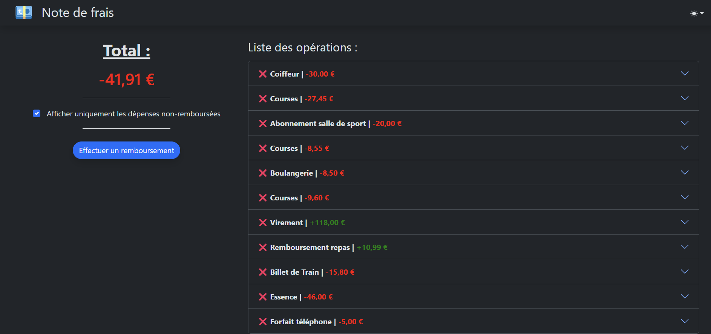

___

# Note de Frais

**Application Web de gestion de dépenses et de remboursements.**

L'utilisateur peut saisir ses opérations depuis l'interface d'administration.
Elles sont affichées sur la page principale. La seconde personne en charge du remboursement de la note de frais peut visualiser les détails, et effectuer un remboursement. Toutes les dépenses sont alors marquées comme remboursées et ne sont plus dues.

## Fonctions 

- Ajouter des dépenses / revenus
- Classement par catégorie
- Calcul du total dû
- Effectuer un remboursement
- Affichage agréable et détaillé

## Installation

- Clôner le dépôt dans un dossier :

```sh
git clone https://github.com/thomas-cvt/note-de-frais.git
```

- (Facultatif) Vous pouvez modifier les variables d'environnement dans ```docker-compose.yml```:
```docker
version: '3'

services:
  db:
    ...
    environment:
      MYSQL_DATABASE: note-de-frais-db
      MYSQL_USER: note-de-frais-user
      MYSQL_PASSWORD: note-de-frais-password
      MYSQL_ROOT_PASSWORD: note-de-frais-root-password

  note-de-frais:
    ...
    environment:
      DB_NAME: note-de-frais-db
      DB_USER: note-de-frais-user
      DB_PASSWORD: note-de-frais-password
      DB_HOST: db
      DB_PORT: 3306
      DEBUG: True
      SERVERNAMES: "*"
```

- Lancer la mise en place des conteneurs avec ```docker-compose.yml```:

```sh
docker-compose up
```

- Vous pouvez accéder à l'application à cet URL : ```http://localhost:8000```

- Et à l'interface d'administration à cet URL : ```http://localhost:8000/admin```

___
# Expense Report

**Web application to manage expenses and refunds**

User can enter their transactions using the administration interface. They are displayed on the main page. The second personin charge of refunding can show details and make the refund. All expenses are then marked as refunded and are no longer due.

## Features

- Add expenses / incomes
- Order by categories
- Calculation of total due
- Make a refund
- Pleasant and detailed display

## Installation

- Clone the repository :

```sh
git clone https://github.com/thomas-cvt/note-de-frais.git
```

- (Optional) You can change environment variables in ```docker-compose.yml``` :
```docker
version: '3'

services:
  db:
    ...
    environment:
      MYSQL_DATABASE: note-de-frais-db
      MYSQL_USER: note-de-frais-user
      MYSQL_PASSWORD: note-de-frais-password
      MYSQL_ROOT_PASSWORD: note-de-frais-root-password

  note-de-frais:
    ...
    environment:
      DB_NAME: note-de-frais-db
      DB_USER: note-de-frais-user
      DB_PASSWORD: note-de-frais-password
      DB_HOST: db
      DB_PORT: 3306
      DEBUG: True
      SERVERNAMES: "*"
```

- Run creation of containers with ```docker-compose.yml```:

```sh
docker-compose up
```

- You can access to the application at this URL : ```http://localhost:8000```

- And to the admin interface at this URL : ```http://localhost:8000/admin```
